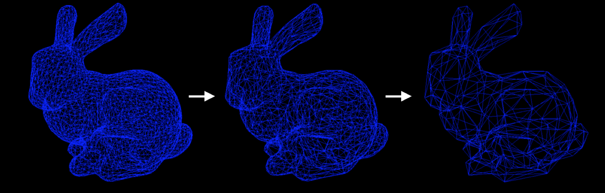

# Mesh Simplification 
Mesh simplification algorithms transform a polygonal mesh into another mesh with fewer vertices, edges and faces. The approximation produced generally satisfies a user defined criterion such as target face count or a maximum tolerable error. 

Iteratively contracting edges is an efficient and commonly employed simplification approach that preserves mesh topology. It associates a cost of collapse with each edge that determines the contraction to perform during each iteration. To estimate this cost, this implements quadric error metrics based mesh simplification by Garland et al.

Note: Requires Eigen 3.2.4 and assumes it is in /usr/local/Cellar/eigen/3.2.4/include/eigen3/
      Requires boost 1.57 and assumes it is in /usr/local/Cellar/boost/1.57.0/include
